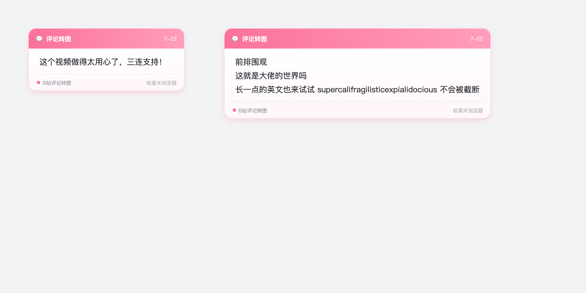

# B站评论转图片发布

一个 Tampermonkey / 油猴脚本：在 B 站评论区「发布」按钮旁注入「🖼️ 转图发布」按钮，把评论框里的文字渲染成美观的图片卡片，以**图片评论**的形式发布。

## 特性

- **一键转图发布**：评论文字 → 图片 → 图片评论。发布正文固定为「文字转图片」，原文字只出现在图片里，不会进正文。
- **美观卡片**：圆角白卡 + 粉色柔和投影、顶部粉色渐变品牌条、淡粉渐变正文背景、底部品牌水印。
- **穿透 Shadow DOM**：B 站评论区是 Web Component，脚本递归穿透 shadow root 注入按钮并读取输入框。
- **纯前端调官方接口**：上传图床 `upload_bfs` + 发布 `reply/add`（含 WBI 签名），无需后端。
- **多页面支持**：视频 / 番剧 / 动态（opus、`_dynamic`）/ 列表页。

## 安装

1. 安装 [Tampermonkey](https://www.tampermonkey.net/) 等用户脚本管理器。
2. 点击 Tampermonkey 图标 → 「管理面板」→ 顶部「+ 新建脚本」，清空默认模板。
3. 打开本仓库的 [`bilibili-comment-to-image.user.js`](bilibili-comment-to-image.user.js)，全选复制其全部内容，粘贴进新建脚本编辑器。
4. 按 `Ctrl/Cmd + S` 保存，确保脚本处于启用状态。
5. 打开任意 B 站视频 / 动态，评论框「发布」按钮右侧会出现粉色「🖼️ 转图发布」。

## 使用

- 在评论框输入文字 → 点「🖼️ 转图发布」。
- 脚本会生成图片、上传、发布为图片评论，并清空评论框。
- 需要登录 B 站（依赖 `bili_jct` 等 cookie）。

## 预览

## 说明

- 发布接口若被 B 站调整可能失效，失败时会有 toast 提示。
- 图片评论需账号具备相应权限。

## License

MIT
